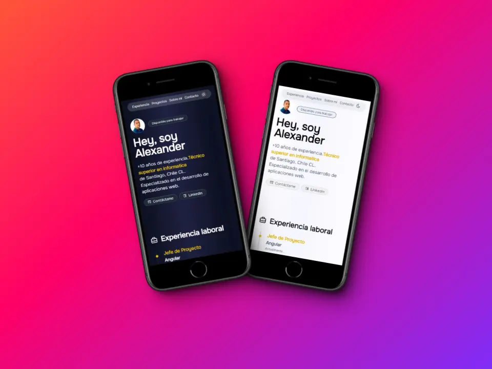

<!-- PROJECT LOGO -->
 

    

  <h3 align="center">Portfolio</h3>

  

    Challenge ONE | Portfolio
     
    <a href="https://alexanderpolanco.github.io/chanllage-one-portfolio/" target="_blank"><strong>Ver demo »</strong></a>
     
  

<!-- ABOUT THE PROJECT -->

## Acerca del proyecto

[![Vista desktop][product-screenshot-desktop]](https://alexanderpolanco.github.io/chanllage-one-portfolio/)

Este portfolio es una actividad recomendada de realizar por el programe G6 ONE. La idea es poner en práctica lo aprendido con este challenge.

### Requisitos para la construcción del portfolio

#### Se debe aplicar todo lo aprendido hasta el momento:

- HTML 5
- CSS 3
- FLEXBOX

### Desarrollo

La intención del challenge es aprender a usar los leguajes y recursos bases de la plataforma web tales como los son:

- [![JavaScript][JavaScript]][JavaScript-url]
- [![HTML5][HTML5]][HTML5-url]
- [![CSS3][CSS3]][CSS3-url]

<!-- LICENSE -->

## Licencia

Distribuido bajo licencia GPL. Ver `LICENSE.txt` para más información.

(<a href="#encabezado">back to top</a>)

<!-- MARKDOWN LINKS & IMAGES -->

[JavaScript]: https://img.shields.io/badge/javascript-grey?logo=javascript
[JavaScript-url]: https://developer.mozilla.org/es/docs/Web/JavaScript
[HTML5]: https://img.shields.io/badge/html5-blue?logo=html5
[HTML5-url]: https://developer.mozilla.org/es/docs/Glossary/HTML5
[CSS3]: https://img.shields.io/badge/css3-orange?logo=css3
[CSS3-url]: https://developer.mozilla.org/es/docs/Web/CSS
[product-screenshot-desktop]: ./assets/shots_so.webp
